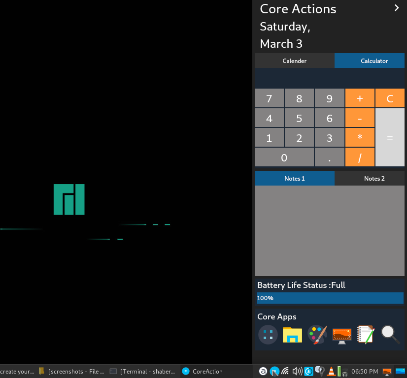
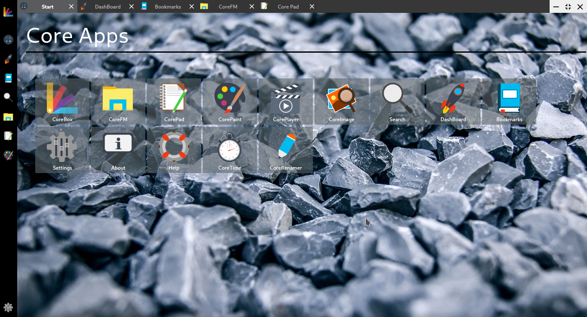
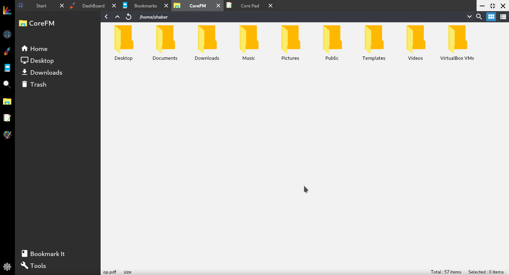

# CoreBox

## Corebox is combination of some common desktop apps with bookmark support. It's like a window manager for coreapps.

* Download the sources
   - Git: `git clone https://github.com/rahmanshaber/corebox`
* Enter `coreBox`
* Open the terminal and type: `qmake && make`
* To install, as root type: `make install`

### Dependencies:
* qt5
* qt5-charts
* qt5-multimedia
* qt5-x11extras
* libmagic-dev/libmagic-mgc/libmagic1
* engrampa(for Archive support)

### Known Bugs
* Cheack the To-Do.txt in doc folder for known bugs.

### Help Us
* We need to add package for this app.Appimage is in top priority.so if any one could guide us how to do that it will be helpful.
* see the Help Us page in Help app of corebox for more.