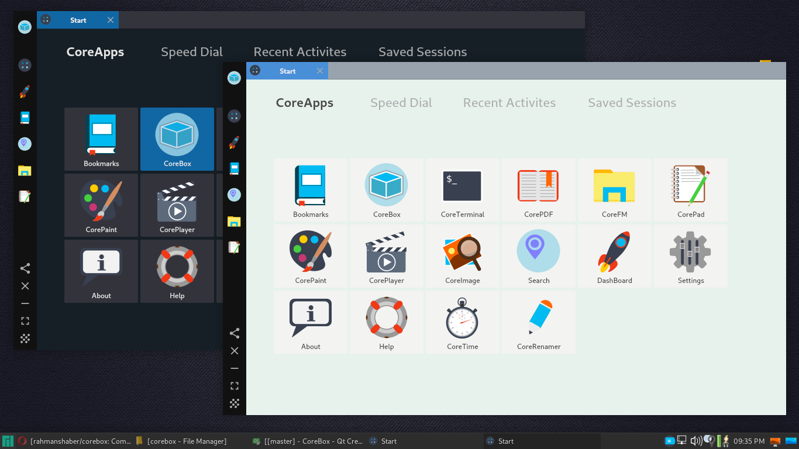
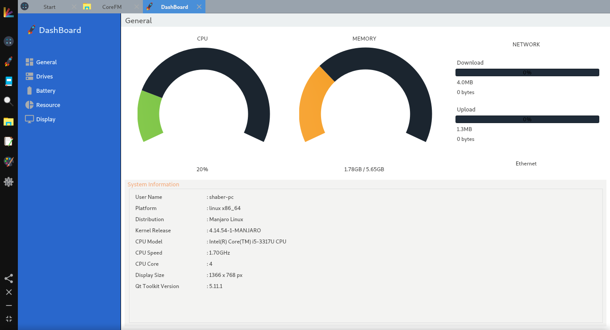
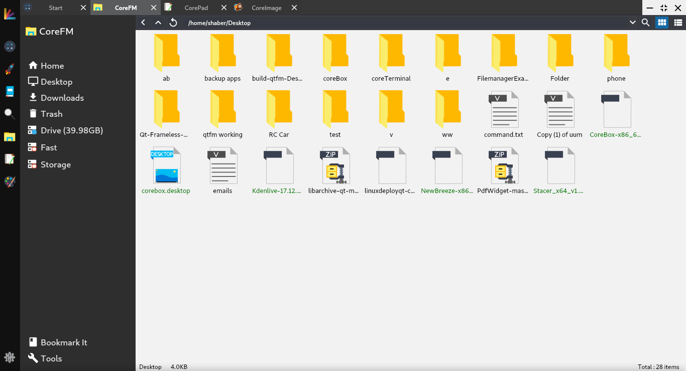
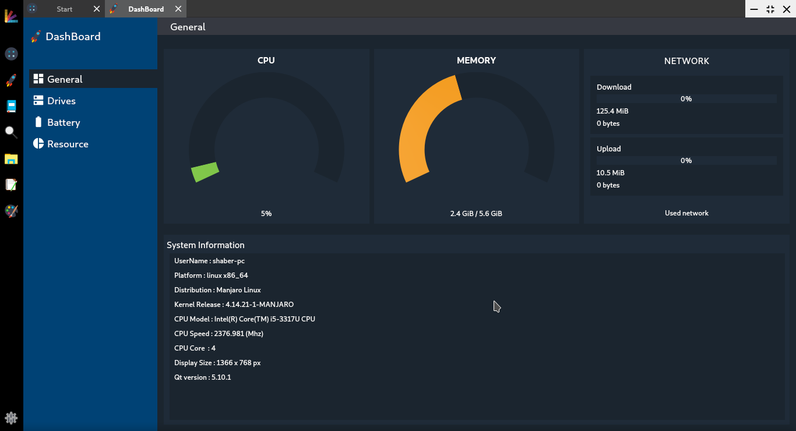

# CoreBox

## CoreBox is combination of some common desktop apps with bookmark support. It's like a window manager for CoreApps.
## For Linux Only.

### Download
* Version 2.1 released date Monday, March 26, 2018.
* Here is the app download [link](https://github.com/rahmanshaber/corebox/releases "Title") .
* See the fixed bug and new features [here](https://github.com/rahmanshaber/corebox/blob/master/docs/ChangeLog "Title") .

### Changes in latest release
* Total 60+ fixes in this release.
* full trash support.
* redesinged coreaction.
* added drive list in corefm.
* changed properties ui in corefm and more in [here](https://github.com/rahmanshaber/corebox/blob/master/docs/ChangeLog "Title") .

### Build
* To build see the buidinfo.txt in doc folder [here](https://github.com/rahmanshaber/corebox/blob/master/docs/buildinfo.txt "Title") 

### Dependencies:
* qt5
* qt5-charts
* qt5-svg5
* qt5-multimedia
* qt5-x11extras
* file
* libmagic-dev/libmagic-mgc/libmagic1
* engrampa(for Archive support)

### Known Bugs
* Opening two dashboard ,crash the whole app.
* Window movement needs right mouse hold.
* Check the To-Do.txt in doc folder for known bugs.

### Help Us
* Move the CorePlayer to QtAV. here is the [link](https://github.com/wang-bin/QtAV "Title") .
  Please make simple player with qtav and send via email to us.
  Please in qmake.not cmake.We tried the example's of QtAV .but they don't work.
* We need to add package for this app.DEB is in top priority.so if any one could guide us how to do that it will be helpful.
* Also add the app in AUR.
* Some of the apps has old code,so they have some issue in them.Please review the code and help us fix them.
* See the "HelpUs" page in Help app for more problems.
